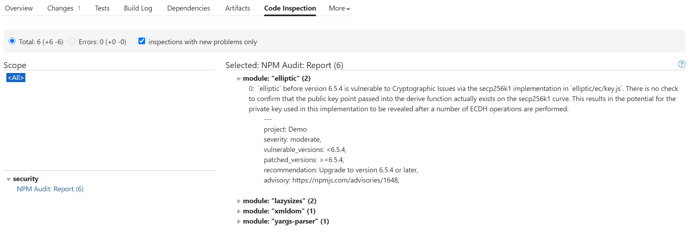

`audit-teamcity-report` is a simple CLI and library that prints out an NPM package audit in TeamCity service message format. Useful for running security audits in CI/CD, and monitoring changes.

This package calls the NPM restful API directly to gather security vulnerability data and suggestions. This makes it faster than running `npm audit` and then using the output to generate readable TeamCity service messages.

# Getting Started

Install with Yarn:

```bash
$ yarn add --dev audit-teamcity-report
```

Install with NPM:

```bash
$ npm i --save-dev audit-teamcity-report
```

# Demo

When the audit identifies vulnerabilities for your packages, a new tab for that build labeled "Code Inspection" will appear. You'll get a list of all packages that require an update, with a description and link to the advisory.



# Useage

The package can be used in two ways, via the CLI or by consuming the exported functions. `audit-teamcity-report` will, by default, load your `package.json` file from the current working directory. It'll then check for a `package-lock.json` file, if this isn't found, it will try and load a `yarn.lock` file. If neither lock files are found, it'll run an audit on your top level dependencies only.

If you'd like to only report on packages installed directly into your project (top level), you can use the `topLevelOnly` argument to do so.

## CLI

```bash
$ audit-teamcity-report
```

## Node

```javascript
import { readDependencies, auditService, outputReport } from 'audit-teamcity-report';

/*[...]*/

const project = await readDependencies({ topLevelOnly: false });
const result = await auditService(project);

// optional
outputReport(result);
```
